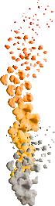
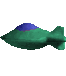
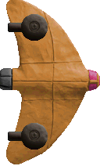
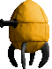
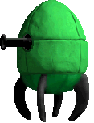

# Enemies

This page aims to document all known enemy types, their numerical values and their functionality. All enemy names were found in the Platypus II executable using a hex editor.

Enemy type numbers are used in both wave (action 21) and enemy (action 22) as arg1. The subsequent arguments discussed under each enemy type on this page only apply to enemy (action 22).

## bullet (1)

Normal enemy bullet. Unused on its own during normal gameplay.

### args:
| arg# | Name | Description                                                                                                                                                                                        |
|------|------|----------------------------------------------------------------------------------------------------------------------------------------------------------------------------------------------------|
| `2`  | `x`  | Spawn x-position                                                                                                                                                                                   |
| `3`  | `y`  | Spawn y-position                                                                                                                                                                                   |
| `4`  | `a`  | Movement angle, in degrees. <ul> <li>0 degrees is directly leftwards.</li> <li>Positive values change direction clockwise.</li> <li>Negative values change direction counter-clockwise.</li> </ul> |
| `5`  | `d`  | Movement speed. <ul> <li>Negative values result in reversed movement.</li> <li>A value of 0 causes the projectile to fallback on its default speed.</li> </ul>                                     |

## flame (2)

Flame that can be fired by an enemy or flamejet. Deals damage to the player and disappears after a while. Unused on its own during normal gameplay.

### args:
| arg# | Name | Description                                                                                                                                                                                        |
|------|------|----------------------------------------------------------------------------------------------------------------------------------------------------------------------------------------------------|
| `2`  | `x`  | Spawn x-position                                                                                                                                                                                   |
| `3`  | `y`  | Spawn y-position                                                                                                                                                                                   |
| `4`  | `a`  | Movement angle, in degrees. <ul> <li>0 degrees is directly leftwards.</li> <li>Positive values change direction clockwise.</li> <li>Negative values change direction counter-clockwise.</li> </ul> |
| `5`  | `d`  | Movement speed. <ul> <li>Negative values result in reversed movement.</li> <li>A value of 0 causes the projectile to fallback on its default speed.</li> </ul>                                     |

## missile (3)

Missile that homes in on the player while leaving a smoke trail. Explodes after a while if not destroyed by the player. Unused on its own during normal gameplay.

### args:
| arg# | Name | Description                                                                                                                                                                                        |
|------|------|----------------------------------------------------------------------------------------------------------------------------------------------------------------------------------------------------|
| `2`  | `x`  | Spawn x-position                                                                                                                                                                                   |
| `3`  | `y`  | Spawn y-position                                                                                                                                                                                   |
| `4`  | `a`  | Movement angle, in degrees. <ul> <li>0 degrees is directly leftwards.</li> <li>Positive values change direction clockwise.</li> <li>Negative values change direction counter-clockwise.</li> </ul> |
| `5`  | `d`  | Movement speed. <ul> <li>Negative values result in reversed movement.</li> <li>A value of 0 causes the projectile to fallback on its default speed.</li> </ul>                                     |

## laser (4)

Laser that is fired by some enemies. Unused on its own during normal gameplay.

### args:
| arg# | Name | Description                                                                                                                                                                                        |
|------|------|----------------------------------------------------------------------------------------------------------------------------------------------------------------------------------------------------|
| `2`  | `x`  | Spawn x-position                                                                                                                                                                                   |
| `3`  | `y`  | Spawn y-position                                                                                                                                                                                   |
| `4`  | `a`  | Movement angle, in degrees. <ul> <li>0 degrees is directly leftwards.</li> <li>Positive values change direction clockwise.</li> <li>Negative values change direction counter-clockwise.</li> </ul> |
| `5`  | `d`  | Movement speed. <ul> <li>Negative values result in reversed movement.</li> <li>A value of 0 causes the projectile to fallback on its default speed.</li> </ul>                                     |

## orb (5)

Large projectile that is typically fired upwards from red turrets before falling down. Unused on its own during normal gameplay.

### args:
| arg# | Name | Description                                                                                                                                                                                        |
|------|------|----------------------------------------------------------------------------------------------------------------------------------------------------------------------------------------------------|
| `2`  | `x`  | Spawn x-position                                                                                                                                                                                   |
| `3`  | `y`  | Spawn y-position                                                                                                                                                                                   |
| `4`  | `a`  | Movement angle, in degrees. <ul> <li>0 degrees is directly leftwards.</li> <li>Positive values change direction clockwise.</li> <li>Negative values change direction counter-clockwise.</li> </ul> |
| `5`  | `d`  | Movement speed. <ul> <li>Negative values result in reversed movement.</li> <li>A value of 0 causes the projectile to fallback on its default speed.</li> </ul>                                     |

## glob (6)

Indestructible projectile that is fired by some enemies in level 5 (e.g. podship). Unused on its own during normal gameplay.

### args:
| arg# | Name | Description                                                                                                                                                                                        |
|------|------|----------------------------------------------------------------------------------------------------------------------------------------------------------------------------------------------------|
| `2`  | `x`  | Spawn x-position                                                                                                                                                                                   |
| `3`  | `y`  | Spawn y-position                                                                                                                                                                                   |
| `4`  | `a`  | Movement angle, in degrees. <ul> <li>0 degrees is directly leftwards.</li> <li>Positive values change direction clockwise.</li> <li>Negative values change direction counter-clockwise.</li> </ul> |
| `5`  | `d`  | Movement speed. <ul> <li>Negative values result in reversed movement.</li> <li>A value of 0 causes the projectile to fallback on its default speed.</li> </ul>                                     |

## bomb (7)

Explosive bomb that is dropped by bomber and squidcangreen. Explodes into bombfrags when shot by the player. Unused on its own during normal gameplay.

### args:
| arg# | Name | Description                                                                                                                                                                                        |
|------|------|----------------------------------------------------------------------------------------------------------------------------------------------------------------------------------------------------|
| `2`  | `x`  | Spawn x-position                                                                                                                                                                                   |
| `3`  | `y`  | Spawn y-position                                                                                                                                                                                   |
| `4`  | `a`  | Movement angle, in degrees. <ul> <li>0 degrees is directly leftwards.</li> <li>Positive values change direction clockwise.</li> <li>Negative values change direction counter-clockwise.</li> </ul> |
| `5`  | `d`  | Movement speed. <ul> <li>Negative values result in reversed movement.</li> <li>A value of 0 causes the projectile to fallback on its default speed.</li> </ul>                                     |

## bombfrag (8)

Damaging fragments emitted when a bomb or mine explodes. Unused on its own during normal gameplay.

### args:
| arg# | Name | Description                                                                                                                                                                                        |
|------|------|----------------------------------------------------------------------------------------------------------------------------------------------------------------------------------------------------|
| `2`  | `x`  | Spawn x-position                                                                                                                                                                                   |
| `3`  | `y`  | Spawn y-position                                                                                                                                                                                   |
| `4`  | `a`  | Movement angle, in degrees. <ul> <li>0 degrees is directly leftwards.</li> <li>Positive values change direction clockwise.</li> <li>Negative values change direction counter-clockwise.</li> </ul> |
| `5`  | `d`  | Movement speed. <ul> <li>Negative values result in reversed movement.</li> <li>A value of 0 causes the projectile to fallback on its default speed.</li> </ul>                                     |

## mine (9)

Bomb that is tied to a balloon. Shooting the balloon will cause the bomb to fall. The balloon type can be customised. Spawns with a random y-speed.

### args:
| arg# | Name   | Description                                                                                                                                                                                                                                                                |
|------|--------|----------------------------------------------------------------------------------------------------------------------------------------------------------------------------------------------------------------------------------------------------------------------------|
| `2`  | `type` | Balloon type: <table> <thead> <tr> <th>Value</th> <th>Balloon</th> </tr> </thead> <tbody> <tr> <td>`0`</td> <td>Pale balloon. Shooting it releases some fruit</td> </tr> <tr> <td>`1`</td> <td>Red balloon. Shooting it releases 12 bombfrags</td> </tr> </tbody> </table> |
| `3`  | `y`    | Spawn y-position. <ul> <li>A value of 0 will cause the enemy to be spawned at a random y-position</li> </ul>                                                                                                                                                               |
| `4`  | `x`    | Spawn x-position. <ul> <li> Non-zero values cause the mine to spawn on-screen out of thin air at the specified coordinates </li> <li> Use 0 to spawn off-screen as usual </li> </ul>                                                                                       |

## rock (10)

Red-hot rock that falls from the top of the screen during volcanic eruptions. Size/sprite is randomised. Unused on its own during normal gameplay.

### args:
| arg# | Name | Description      |
|------|------|------------------|
| `2`  | `x`  | Spawn x-position |
| `3`  | `y`  | Spawn y-position |

## arch (11)

Unused during normal gameplay.

### args:
(TODO TEST)

## pylon (12)

Unused during normal gameplay.

### args:
(TODO TEST)

## telegraph (13)

Unused during normal gameplay.

### args:
(TODO TEST)

## lava (14)

Spawns a jet of flames upwards.

### args:
None

## buoy (15)

Buoy equipped with a cannon that fires two lasers upwards.

### args:
None

## dish (16)

Destructible satellite dish that appears near the bottom of the screen and damages the player upon contact. Spawns an instance of tile number 99 below it on layer 1. If this tile does not exist, the enemy will spawn out of thin air in the middle of the screen.

### args:
None

## building (17)

Destructible building that damages the player on contact. Spawns out of thin air at the specified position. Unused during normal gameplay. For the standard version that spawns at the bottom of the screen and leaves behind a base, see [scenery type 16](scenery.md#building-16).

### args:
| arg# | Name | Description      |
|------|------|------------------|
| `2`  | `x`  | Spawn x-position |
| `3`  | `y`  | Spawn y-position |

## tank (18)

Destructible tank that damages the player on contact. Spawns out of thin air at the specified position. Unused during normal gameplay. For the standard version that spawns at the bottom of the screen and leaves behind a base, see [scenery type 17](scenery.md#tank-17).

### args:
| arg# | Name | Description      |
|------|------|------------------|
| `2`  | `x`  | Spawn x-position |
| `3`  | `y`  | Spawn y-position |

## wallgun (19)

Destructible wall-mounted gun that aims and fires bullets at the player. Leaves behind a ruined base panel (scenery type 15) after it is destroyed. Spawns on layer 1.

### args:
| arg# | Name     | Description                       |
|------|----------|-----------------------------------|
| `2`  | `layerx` | Spawn x-position, based on tiles. |
| `3`  | `y`      | Spawn y-position.                 |

## icbm (20)

Large missile that flies downwards from the left of the screen at an angle.

### args:
| arg# | Name      | Description       |
|------|-----------|-------------------|
| `2`  | `y`       | Spawn y-position. |

## domeship (21)

Small spherical/dome-shaped enemy that flies straight from the left before doing a loop and flying off-screen to the left. Normally encountered in formations.

### args:
| arg# | Name      | Description                                                                                                                                                                        |
|------|-----------|------------------------------------------------------------------------------------------------------------------------------------------------------------------------------------|
| `2`  | `y`       | Spawn y-position. <ul> <li> If this value is ≥ 300, the flight path will be vertically flipped </li> </ul>                                                                         |
| `3`  | `offsetx` | Spawn x-position offset. <ul> <li> This value is generally used for arranging waves </li> <li> Negative values can cause the enemy to appear on-screen out of thin air </li> </ul> |

## domeship2 (22)

Sprite-swapped variant of domeship with otherwise identical behaviour. Normally encountered in formations.

### args:
| arg# | Name      | Description                                                                                                                                                                        |
|------|-----------|------------------------------------------------------------------------------------------------------------------------------------------------------------------------------------|
| `2`  | `y`       | Spawn y-position. <ul> <li> If this value is ≥ 300, the flight path will be vertically flipped </li> </ul>                                                                         |
| `3`  | `offsetx` | Spawn x-position offset. <ul> <li> This value is generally used for arranging waves </li> <li> Negative values can cause the enemy to appear on-screen out of thin air </li> </ul> |

## saucer (23)

Grey flying saucer enemy that flies leftwards from the right of the screen, occasionally shooting bullets at the player. Normally encountered in formations.

### args:
| arg# | Name      | Description                                                                                                                                                                        |
|------|-----------|------------------------------------------------------------------------------------------------------------------------------------------------------------------------------------|
| `2`  | `y`       | Spawn y-position.                                                                                                                                                                  |
| `3`  | `offsetx` | Spawn x-position offset. <ul> <li> This value is generally used for arranging waves </li> <li> Negative values can cause the enemy to appear on-screen out of thin air </li> </ul> |

## saucer2 (24)

Yellow flying saucer enemy that flies leftwards from the right of the screen, occasionally shooting bullets at the player. Normally encountered in formations.

### args:
| arg# | Name      | Description                                                                                                                                                                        |
|------|-----------|------------------------------------------------------------------------------------------------------------------------------------------------------------------------------------|
| `2`  | `y`       | Spawn y-position.                                                                                                                                                                  |
| `3`  | `offsetx` | Spawn x-position offset. <ul> <li> This value is generally used for arranging waves </li> <li> Negative values can cause the enemy to appear on-screen out of thin air </li> </ul> |

## saucerred (25)

Reddish-brown flying saucer enemy that flies leftwards from the right of the screen and has vertical movement based on a negative sine function. Normally encountered in formations that grant weapon stars upon complete destruction.

### args:
| arg# | Name      | Description                                                                                                                                                                        |
|------|-----------|------------------------------------------------------------------------------------------------------------------------------------------------------------------------------------|
| `2`  | `y`       | Spawn y-position.                                                                                                                                                                  |
| `3`  | `offsetx` | Spawn x-position offset. <ul> <li> This value is generally used for arranging waves </li> <li> Negative values can cause the enemy to appear on-screen out of thin air </li> </ul> |
| `4`  | `a`       | Spawn angle. <ul> <li> This value shifts the starting angle of the sinusoidal vertical movement </li> </ul>                                                                        |

## zipper (26)

Small orange gunship-like enemy that flies rightwards from the left of the screen until it reaches the right, then slowly moves off-screen to the left. Normally encountered in formations.

### args:
| arg# | Name      | Description                                                                                                                                                                        |
|------|-----------|------------------------------------------------------------------------------------------------------------------------------------------------------------------------------------|
| `2`  | `y`       | Spawn y-position.                                                                                                                                                                  |
| `3`  | `offsetx` | Spawn x-position offset. <ul> <li> This value is generally used for arranging waves </li> <li> Negative values can cause the enemy to appear on-screen out of thin air </li> </ul> |

## fish (27)

Grey fish-shaped enemy that flies leftwards from the right of the screen before turning upwards or downwards. Occasionally fires lasers. Normally encountered in formations.

### args:
| arg# | Name      | Description                                                                                                                                                                                                                                                                                                                                                                    |
|------|-----------|--------------------------------------------------------------------------------------------------------------------------------------------------------------------------------------------------------------------------------------------------------------------------------------------------------------------------------------------------------------------------------|
| `2`  | `y`       | Spawn y-position.                                                                                                                                                                                                                                                                                                                                                              |
| `3`  | `offsetx` | Spawn x-position offset. <ul> <li> This value is generally used for arranging waves </li> <li> Negative values can cause the enemy to appear on-screen out of thin air </li> </ul>                                                                                                                                                                                             |
| `4`  | `path`    | Enemy flight path: <table> <thead> <tr> <th>Value</th> <th>Path</th> </tr> </thead> <tbody> <tr> <td>`-1`</td> <td>^ path, max at y=300</td> </tr> <tr> <td>`0`</td> <td>Fly straight then begin turning vertically upon reaching the horizontally center. Direction can be set using arg5.</td> </tr> <tr> <td>`1`</td> <td>v path, min at y=300</td> </tr> </tbody> </table> |
| `5`  | `my`      | Set y-movement direction when arg4 = 0: <table> <thead> <tr> <th>Value</th> <th>Direction</th> </tr> </thead> <tbody> <tr> <td>`-1`</td> <td>Upwards</td> </tr> <tr> <td>`0`</td> <td>Random</td> </tr> <tr> <td>`1`</td> <td>Downwards</td> </tr> </tbody> </table>                                                                                                           |

## fishred (28)

Reddish-brown fish-shaped enemy that flies leftwards from the right of the screen and occasionally fires lasers. Normally encountered in formations that grant weapon stars upon complete destruction.

### args:
- **y (arg2):** y-position to spawn at
- **offsetx (arg3):** spawn x-position offset. Can cause the enemy to appear on-screen out of thin air
- **path (arg4):** -1 fly up to final height, 0 straight then turn back, 1 fly down to final height?
- **disty (arg5):** -1 or 1 path: y-distance to travel before going straight? 0 path: 1 to turn down, -1 to turn up

## homingfish (29)

Green fish-shaped enemy that briefly attempts to home in on the player before flying off-screen. Normally encountered in formations.

### args:
| arg# | Name      | Description                                                                                                                                                                                                                                                           |
|------|-----------|-----------------------------------------------------------------------------------------------------------------------------------------------------------------------------------------------------------------------------------------------------------------------|
| `2`  | `y`       | Spawn y-position.                                                                                                                                                                                                                                                     |
| `3`  | `offsetx` | Spawn x-position offset. <ul> <li> This value is generally used for arranging waves </li> <li> Negative values can cause the enemy to appear on-screen out of thin air </li> </ul>                                                                                    |
| `4`  | `path`    | Enemy flight path: <table> <thead> <tr> <th>Value</th> <th>Path</th> </tr> </thead> <tbody> <tr> <td>`0`</td> <td>Fly leftwards from the right of the screen</td> </tr> <tr> <td>`1`</td> <td>Fly rightwards from the left of the screen</td> </tr> </tbody> </table> |

## horseshoe (30)

Blue horseshoe-shaped enemy that flies in from the right before turning and flying leftwards, then turning once more to fly rightwards off-screen. Normally encountered in formations.

### args:
| arg# | Name      | Description                                                                                                                                                                                                                                                    |
|------|-----------|----------------------------------------------------------------------------------------------------------------------------------------------------------------------------------------------------------------------------------------------------------------|
| `2`  | `y`       | Spawn y-position.                                                                                                                                                                                                                                              |
| `3`  | `offsetx` | Spawn x-position offset. <ul> <li> This value is generally used for arranging waves </li> <li> Negative values can cause the enemy to appear on-screen out of thin air </li> </ul>                                                                             |
| `4`  | `my`      | Set initial y-movement direction: <table> <thead> <tr> <th>Value</th> <th>Direction</th> </tr> </thead> <tbody> <tr> <td>`-1`</td> <td>Upwards</td> </tr> <tr> <td>`0`</td> <td>Random</td> </tr> <tr> <td>`1`</td> <td>Downwards</td> </tr> </tbody> </table> |

## jumper (31)

Yellow horseshoe-shaped enemy that flies upwards from the bottom before turning and flying downwards off-screen. Has slight horizontal speed during its flight path. Normally encountered in formations. Single and formation spawns do not work in level 1.

### args:
| arg# | Name      | Description                                                                                                                                                                        |
|------|-----------|------------------------------------------------------------------------------------------------------------------------------------------------------------------------------------|
| `2`  | `x`       | Spawn y-position.                                                                                                                                                                  |
| `3`  | `offsety` | Spawn y-position offset. <ul> <li> This value is generally used for arranging waves </li> <li> Negative values can cause the enemy to appear on-screen out of thin air </li> </ul> |
| `4`  | `dx`      | Set x-speed.                                                                                                                                                                       |

## ray (32)

Unused classic ray enemy. Otherwise identical to the new v2ray.

### args:
| arg# | Name      | Description                                                                                                                                                                                                                                            |
|------|-----------|--------------------------------------------------------------------------------------------------------------------------------------------------------------------------------------------------------------------------------------------------------|
| `2`  | `y`       | Spawn y-position.                                                                                                                                                                                                                                      |
| `3`  | `offsetx` | Spawn x-position offset. <ul> <li> This value is generally used for arranging waves </li> <li> Negative values can cause the enemy to appear on-screen out of thin air </li> </ul>                                                                     |
| `4`  | `my`      | Set y-movement direction: <table> <thead> <tr> <th>Value</th> <th>Direction</th> </tr> </thead> <tbody> <tr> <td>`-1`</td> <td>Upwards</td> </tr> <tr> <td>`0`</td> <td>Random</td> </tr> <tr> <td>`1`</td> <td>Downwards</td> </tr> </tbody> </table> |

## v2ray (33)

Teal-coloured variant of the classic ray enemy. Flies leftwards before spinning and flying upwards or downwards.

### args:
| arg# | Name      | Description                                                                                                                                                                                                                                            |
|------|-----------|--------------------------------------------------------------------------------------------------------------------------------------------------------------------------------------------------------------------------------------------------------|
| `2`  | `y`       | Spawn y-position.                                                                                                                                                                                                                                      |
| `3`  | `offsetx` | Spawn x-position offset. <ul> <li> This value is generally used for arranging waves </li> <li> Negative values can cause the enemy to appear on-screen out of thin air </li> </ul>                                                                     |
| `4`  | `my`      | Set y-movement direction: <table> <thead> <tr> <th>Value</th> <th>Direction</th> </tr> </thead> <tbody> <tr> <td>`-1`</td> <td>Upwards</td> </tr> <tr> <td>`0`</td> <td>Random</td> </tr> <tr> <td>`1`</td> <td>Downwards</td> </tr> </tbody> </table> |

## goldfish (34)

Purple (not gold) enemy that flies in leftwards from the right of the screen and shoots several bullets in a spread formation before flying rightwards off-screen. Normally encountered in formations.

### args:
| arg# | Name      | Description                                                                                                                                                                        |
|------|-----------|------------------------------------------------------------------------------------------------------------------------------------------------------------------------------------|
| `2`  | `y`       | Spawn y-position.                                                                                                                                                                  |
| `3`  | `offsetx` | Spawn x-position offset. <ul> <li> This value is generally used for arranging waves </li> <li> Negative values can cause the enemy to appear on-screen out of thin air </li> </ul> |

## hovergun (35)

Red flying turret with squid fins that shoots orbs. Flies directly downwards from the top of the screen until it reaches a specified y-position, then flies to the right before finally moving leftwards off-screen.

### args:
| arg# | Name   | Description                                |
|------|--------|--------------------------------------------|
| `2`  | `x`    | Spawn x-position.                          |
| `3`  | `endy` | Final y-position after downwards movement. |

## hoverlauncher (36)

Has identical behaviour to hovergun, but is purple and shoots missiles instead.

### args:
| arg# | Name   | Description                                |
|------|--------|--------------------------------------------|
| `2`  | `x`    | Spawn x-position.                          |
| `3`  | `endy` | Final y-position after downwards movement. |

## flipplane (37)

Purple enemy that flies in from the left before reaching the right of the screen and turning to reveal its true wingspan and two mounted turrets. Shoots bullets at the player as it flies back off-screen to the left.

### args:
| arg# | Name      | Description       |
|------|-----------|-------------------|
| `2`  | `y`       | Spawn y-position. |

## flipplaneorange (38)

Slower orange variant of flipplane.

### args:
| arg# | Name      | Description       |
|------|-----------|-------------------|
| `2`  | `y`       | Spawn y-position. |

## bomber (39)

Red flipplane that flies from the left to the right of the screen while dropping bombs.

### args:
| arg# | Name      | Description       |
|------|-----------|-------------------|
| `2`  | `y`       | Spawn y-position. |

## lasersquid (40)

Small yellow squid enemy that hovers around its position on the right of the screen while shooting lasers directly leftwards before moving leftwards off-screen.

### args:
| arg# | Name      | Description       |
|------|-----------|-------------------|
| `2`  | `y`       | Spawn y-position. |

## gunsquid (41)

Large green squid variant with similar movement patterns but shoots several bullets in a spread formation.

### args:
| arg# | Name      | Description       |
|------|-----------|-------------------|
| `2`  | `y`       | Spawn y-position. |

## lightningsquid (42)

Brown trashcan-shaped squid variant with similar movement patterns but shoots lightning.

### args:
| arg# | Name      | Description       |
|------|-----------|-------------------|
| `2`  | `y`       | Spawn y-position. |

## bombsquid (43)

Teal trashcan-shaped squid variant with similar movement patterns but drops bombs.

### args:
| arg# | Name      | Description       |
|------|-----------|-------------------|
| `2`  | `y`       | Spawn y-position. |

## yellowie (44)

Yellow passive enemy that flies in from the left before stopping at the far right, then flying leftwards off-screen.

### args:
| arg# | Name      | Description       |
|------|-----------|-------------------|
| `2`  | `y`       | Spawn y-position. |

## greenie (45)

Slow green passive enemy that flies from left to right.

### args:
| arg# | Name      | Description       |
|------|-----------|-------------------|
| `2`  | `y`       | Spawn y-position. |

## reddie (46)

Large red passive enemy that flies from left to right.

### args:
| arg# | Name      | Description       |
|------|-----------|-------------------|
| `2`  | `y`       | Spawn y-position. |

## gunship (47)

Classic red gunship enemy that flies in from the left and hovers around the horizontal center of the screen while shooting bullets aimed at the player, before flying rightwards off-screen.

### args:
| arg# | Name      | Description       |
|------|-----------|-------------------|
| `2`  | `y`       | Spawn y-position. |

## lasership (48)

Purple gunship variant that flies in from the right and hovers around in place while shooting lasers leftwards, before flying leftwards off-screen.

### args:
| arg# | Name      | Description       |
|------|-----------|-------------------|
| `2`  | `y`       | Spawn y-position. |

## flameship (49)

Yellow gunship variant that with the same movement pattern as the original red gunship, but shoots flames aimed at the player instead.

### args:
| arg# | Name      | Description       |
|------|-----------|-------------------|
| `2`  | `y`       | Spawn y-position. |

## homingship (50)

Large green enemy that flies in from the right before stopping at the far left, then flying back rightwards off-screen. Shoots missiles in pairs.

### args:
| arg# | Name      | Description       |
|------|-----------|-------------------|
| `2`  | `y`       | Spawn y-position. |

## car (51)

Various cars that spawn at the bottom of the screen and move in from the right. The car type can be specified. Car types 3 onwards possess a chain on the front side. Cars can be spawned 220 ticks apart to create the illusion of a train.

### args:
| arg# | Name   | Description                                                                                                                                                                                                                                                                                                                                                                                                                                                                                                                                                                                                                                                                                                                                                                                                                                                                                                        |
|------|--------|--------------------------------------------------------------------------------------------------------------------------------------------------------------------------------------------------------------------------------------------------------------------------------------------------------------------------------------------------------------------------------------------------------------------------------------------------------------------------------------------------------------------------------------------------------------------------------------------------------------------------------------------------------------------------------------------------------------------------------------------------------------------------------------------------------------------------------------------------------------------------------------------------------------------|
| `2`  | `type` | Car type to spawn: <table> <thead> <tr> <th>Value</th> <th>Type</th> </tr> </thead> <tbody> <tr> <td>`0`</td> <td>Red front car equipped with a gun. There is a hole where the missile launcher normally sits</td> </tr> <tr> <td>`1`</td> <td>Red front car equipped with a missile launcher and a gun</td> </tr> <tr> <td>`2`</td> <td>Red front car equipped with a red turret that shoots orbs upwards in a spread formation and a gun</td> </tr> <tr> <td>`3`</td> <td>Empty car with only a chassis</td> </tr> <tr> <td>`4`</td> <td>Gold passive car</td> </tr> <tr> <td>`5`</td> <td>Silver passive car</td> </tr> <tr> <td>`6`</td> <td>Silver car equipped with two guns</td> </tr> <tr> <td>`7`</td> <td>Silver car equipped with a missile launcher</td> </tr> <tr> <td>`8`</td> <td>Silver car equipped with a red turret that shoots orbs upwards in a spread formation</td> </tr> </tbody> </table> |
| `3`  | `path` | Enemy movement path: <table> <thead> <tr> <th>Value</th> <th>Path</th> </tr> </thead> <tbody> <tr> <td>`0`</td> <td>Move from right to left as normal</td> </tr> <tr> <td>`1`</td> <td>Move from right to left as usual but upon reaching the left edge of the screen, move back to the right edge of the screen before moving leftwards off-screen <ul> <li> Only works with car types `0`, `1` and `2` </li> </ul> </td> </tr> </tbody> </table>                                                                                                                                                                                                                                                                                                                                                                                                                                                                 |

## gunboat (52)

Boat enemy that spawns at the bottom of the screen and travels across horizontally while shooting orbs upwards in a spread formation.

### args:
| arg# | Name      | Description                                                                                                                                                                                                                       |
|------|-----------|-----------------------------------------------------------------------------------------------------------------------------------------------------------------------------------------------------------------------------------|
| `2`  | `path`    | Enemy movement path: <table> <thead> <tr> <th>Value</th> <th>Path</th> </tr> </thead> <tbody> <tr> <td>`0`</td> <td>Move from left to right</td> </tr> <tr> <td>`1`</td> <td>Move from right to left</td> </tr> </tbody> </table> |

## missileboat (53)

Smaller boat enemy that spawns at the bottom of the screen and travels across horizontally while shooting missiles.

### args:
| arg# | Name      | Description                                                                                                                                                                                                                       |
|------|-----------|-----------------------------------------------------------------------------------------------------------------------------------------------------------------------------------------------------------------------------------|
| `2`  | `path`    | Enemy movement path: <table> <thead> <tr> <th>Value</th> <th>Path</th> </tr> </thead> <tbody> <tr> <td>`0`</td> <td>Move from left to right</td> </tr> <tr> <td>`1`</td> <td>Move from right to left</td> </tr> </tbody> </table> |

## flameboat (54)

Boat enemy that spawns at the bottom of the screen and travels across horizontally while shooting flames aimed at the player.

### args:
| arg# | Name      | Description                                                                                                                                                                                                                       |
|------|-----------|-----------------------------------------------------------------------------------------------------------------------------------------------------------------------------------------------------------------------------------|
| `2`  | `path`    | Enemy movement path: <table> <thead> <tr> <th>Value</th> <th>Path</th> </tr> </thead> <tbody> <tr> <td>`0`</td> <td>Move from left to right</td> </tr> <tr> <td>`1`</td> <td>Move from right to left</td> </tr> </tbody> </table> |

## boss1 (55)

Large flying orange aircraft that hovers around the right of the screen while firing two pairs of missiles at a time. Instances of fish_green formation 1 and fish_red formation 3 are also spawned as support. Encountered at the end of level 4 during normal gameplay.

### args:
TODO

## boss2 (56)

Large green segmented aircraft that looks and moves like a worm. Each body segment is equipped with a gun, while the head fires pairs of missiles. Flies in from right to left, revealing each segment one by one. Destroying a segment also destroys all previous segments. Once the head is disconnected from its adjacent segment or the left edge of the head touches the left edge of the screen, all undestroyed body segments are despawned and the head hovers around freely while beginning its attack pattern. Instances of saucer2 formation 0 and saucer_red formation 0 are also spawned as support. Encountered at the end of level 2 during normal gameplay.

### args:
TODO

## boss2seg (57)

Unused during normal gameplay.

### args:
TODO

## boss2flyby (58)

Non-destructible variant of boss2 that flies from left to right. Used to introduce the boss before the actual fight begins.

### args:
TODO

## boss2segflyby (59)

Unused during normal gameplay.

### args:
TODO

## boss3 (60)

Tall yellow turret that rises from the bottom of the screen at a random x-position before sinking and rising again elsewhere. Fires lasers, launches missiles and shoots orbs upwards in a spread formation. Instances of fish_red formation 1 are also spawned as support. Encountered at the end of level 1 during normal gameplay.

### args:
TODO

## boss3base (61)

Crashes the game. Unused during normal gameplay.

### args:
None

## boss4 (62)

Large boat attached to a balloon that hovers around the screen freely. Equipped with a missile launcher. Does not appear to automatically spawn any enemies as support. Encountered near the end of level 4 (right before boss1) during normal gameplay.

### args:
TODO

## boss5 (63)

Large segmented orange serpent that flies around the screen along seemingly random paths. The head shoots flames while the tail shoots lasers in a spread formation. Head is initially invulnerable and the body segments must be damaged first. Once all body segments have been fully damaged, the head can be damaged. Instances of fish_green formation 1 and fish_red formations 1 and 3 are also spawned as support. Encountered at the end of level 3 during normal gameplay.

### args:
TODO

## boss5seg (64)

Unused variant of boss5.

### args:
TODO

## boss5enter (65)

Non-destructible variant of boss5 that flies straight up from the bottom of the screen while leaving behind some splashes. Used to introduce the boss before the actual fight begins.

### args:
TODO

## boss6 (66)

Large green brain equipped with a gun along with four segmented arms that end with guns. The arms rotate around the brain in a clockwise direction. Each arm (gun) must be destroyed first, then the eye on the brain will open and can be damaged. Each time after the first three arms are destroyed, the boss flies off to the right and several enemies/formations are spawned in a fixed order at fixed positions before the boss returns. Encountered at the end of level 5 during normal gameplay. Full attack pattern and enemy spawns are listed below:

- The boss initially spawns with four arms and its eye closed. The guns on each arm shoot bullets while the gun under the brain shoots globs. Instances of fish_red formation 3 are spawned as support. Once one arm is destroyed, the boss flies off-screen to the right
- The following enemies/formations are spawned in order:
  - squid formation 0
  - virus formation 0
  - blob
  - podship
  - spinner formation 0
  - blob
  - spinner formation 0
  - squid formation 0
  - squid formation 0
- The boss returns with three arms but otherwise the exact same behaviour and support spawns as before
- The following enemies/formations are spawned in order:
  - virus formation 1
  - worm formation 0
  - eyeball
  - podship
  - worm formation 0
  - eyeball
  - virus formation 0
  - virus formation 1
  - virus formation 0
- The boss returns with two arms and the same behaviour and supports as before, except the firing rate of all guns has been increased
- The following enemies/formations are spawned in order:
  - virus formation 1
  - squid formation 0
  - eyeball
  - 2x podships
  - worm formation 0
  - blob
  - virus formation 0
  - spinner formation 0
  - virus formation 1
- The boss returns with one arm and the firing rate of the last arm gun has been increased further. The gun under the brain now shoots lightning in short bursts instead. Support spawns remain the same.
- Once the last arm is destroyed, the brain begins flying freely while launching missiles and spawning viruses. Virus spawn rate increases as the brain takes more damage. The eye will occasionally open and fire lasers while leaving it vulnerable to attacks. Also spawns instances of fish_red formations 1 and 3 as support

### args:
TODO

## boss6base (67)

Unused during normal gameplay.

### args:
TODO

## boss6arm (68)

Crashes the game. Unused during normal gameplay.

### args:
None

## boss6eye (69)

Crashes the game. Unused during normal gameplay.

### args:
None

## worm (70)

Small brightly coloured worm that flies from right to left. Normally encountered in formations.

### args:
| arg# | Name      | Description                                                                                                                                                                        |
|------|-----------|------------------------------------------------------------------------------------------------------------------------------------------------------------------------------------|
| `2`  | `y`       | Spawn y-position.                                                                                                                                                                  |
| `3`  | `offsetx` | Spawn x-position offset. <ul> <li> This value is generally used for arranging waves </li> <li> Negative values can cause the enemy to appear on-screen out of thin air </li> </ul> |

## eyeball (71)

Large blinking eye that flies in from the left and hovers around the horizontal center of the screen before flying rightwards off-screen. Fires a ring of eight bullets outwards from its center.

### args:
| arg# | Name      | Description                                                                                                                                                                        |
|------|-----------|------------------------------------------------------------------------------------------------------------------------------------------------------------------------------------|
| `2`  | `y`       | Spawn y-position.                                                                                                                                                                  |
| `3`  | `offsetx` | Spawn x-position offset. <ul> <li> This value is generally used for arranging waves </li> <li> Negative values can cause the enemy to appear on-screen out of thin air </li> </ul> |

## blob (72)

Pink jellyfish that flies from left to right.

### args:
| arg# | Name      | Description       |
|------|-----------|-------------------|
| `2`  | `y`       | Spawn y-position. |

## rollship (73)

Small blue fish-like enemy that flies leftwards from the right before spinning and flying upwards or downwards. Normally encountered in formations.

### args:
| arg# | Name      | Description                                                                                                                                                                                                                                            |
|------|-----------|--------------------------------------------------------------------------------------------------------------------------------------------------------------------------------------------------------------------------------------------------------|
| `2`  | `y`       | Spawn y-position.                                                                                                                                                                                                                                      |
| `3`  | `offsetx` | Spawn x-position offset. <ul> <li> This value is generally used for arranging waves </li> <li> Negative values can cause the enemy to appear on-screen out of thin air </li> </ul>                                                                     |
| `4`  | `my`      | Set y-movement direction: <table> <thead> <tr> <th>Value</th> <th>Direction</th> </tr> </thead> <tbody> <tr> <td>`-1`</td> <td>Upwards</td> </tr> <tr> <td>`0`</td> <td>Random</td> </tr> <tr> <td>`1`</td> <td>Downwards</td> </tr> </tbody> </table> |

## chicken (74)

Purple bird-like creature that flies from left to right. Normally encountered in formations.

### args:
| arg# | Name      | Description                                                                                                                                                                        |
|------|-----------|------------------------------------------------------------------------------------------------------------------------------------------------------------------------------------|
| `2`  | `y`       | Spawn y-position.                                                                                                                                                                  |
| `3`  | `offsetx` | Spawn x-position offset. <ul> <li> This value is generally used for arranging waves </li> <li> Negative values can cause the enemy to appear on-screen out of thin air </li> </ul> |

## bug (75)

Yellow pterodactyl-like creature that flies in from the top and homes in on the player before moving leftwards off-screen. Normally encountered in formations.

### args:
| arg# | Name | Description                                                                                                  |
|------|------|--------------------------------------------------------------------------------------------------------------|
| `2`  | `x`  | Spawn x-position. <ul> <li>A value of 0 will cause the enemy to be spawned at a random x-position</li> </ul> |

## tonsil (76)

Fleshy hanging object that damages the player upon impact. The tonsil itself can be destroyed, while the string holding it will not harm the player.

### args:
| arg# | Name   | Description                                                                                                  |
|------|--------|--------------------------------------------------------------------------------------------------------------|
| `2`  | `y`    | Spawn y-position. <ul> <li>A value of 0 will cause the enemy to be spawned at a random y-position</li> </ul> |

## virus (77)

Alien virus with identical behaviour to homingfish. Normally encountered in formations or spawned from ulcers.

### args:
| arg# | Name      | Description                                                                                                                                                                                                                                                           |
|------|-----------|-----------------------------------------------------------------------------------------------------------------------------------------------------------------------------------------------------------------------------------------------------------------------|
| `2`  | `y`       | Spawn y-position.                                                                                                                                                                                                                                                     |
| `3`  | `offsetx` | Spawn x-position offset. <ul> <li> This value is generally used for arranging waves </li> <li> Negative values can cause the enemy to appear on-screen out of thin air </li> </ul>                                                                                    |
| `4`  | `path`    | Enemy flight path: <table> <thead> <tr> <th>Value</th> <th>Path</th> </tr> </thead> <tbody> <tr> <td>`0`</td> <td>Fly leftwards from the right of the screen</td> </tr> <tr> <td>`1`</td> <td>Fly rightwards from the left of the screen</td> </tr> </tbody> </table> |

## spinner (78)

Small spinning eyeball that flies from right to left. Normally encountered in formations.

### args:
| arg# | Name      | Description                                                                                                                                                                        |
|------|-----------|------------------------------------------------------------------------------------------------------------------------------------------------------------------------------------|
| `2`  | `y`       | Spawn y-position.                                                                                                                                                                  |
| `3`  | `offsetx` | Spawn x-position offset. <ul> <li> This value is generally used for arranging waves </li> <li> Negative values can cause the enemy to appear on-screen out of thin air </li> </ul> |

## fang (79)

Sharp tooth that flies in the direction it's facing upon encountering the player. Can spawn on either the top or bottom of the screen.

### args:
| arg# | Name   | Description                                                                                                                                                                                                                                                                                     |
|------|--------|-------------------------------------------------------------------------------------------------------------------------------------------------------------------------------------------------------------------------------------------------------------------------------------------------|
| `2`  | `type` | Spawn location and flight path: <table> <thead> <tr> <th>Value</th> <th>Type</th> </tr> </thead> <tbody> <tr> <td>`0`</td> <td>Spawn at the top of the screen and fly downwards</td> </tr> <tr> <td>`1`</td> <td>Spawn at the bottom of the screen and fly upwards</td> </tr> </tbody> </table> |

## squid (80)

Small pink jellyfish that flies from right to left. Normally encountered in formations.

### args:
| arg# | Name      | Description                                                                                                                                                                        |
|------|-----------|------------------------------------------------------------------------------------------------------------------------------------------------------------------------------------|
| `2`  | `y`       | Spawn y-position.                                                                                                                                                                  |
| `3`  | `offsetx` | Spawn x-position offset. <ul> <li> This value is generally used for arranging waves </li> <li> Negative values can cause the enemy to appear on-screen out of thin air </li> </ul> |

## podship (81)

Blue gunship-like enemy that shoots globs at the player. Flies in from the left and hovers around the horizontal center of the screen before flying rightwards off-screen.

### args:
| arg# | Name      | Description       |
|------|-----------|-------------------|
| `2`  | `y`       | Spawn y-position. |

## miniserpent (82)

Shorter yellow serpent that flies upwards from the bottom of the screen at a random position, turns to the left or right, then falls back down to the bottom of the screen before repeating. Its tail shoots lasers in a spread formation. Only its body segments can be damaged and it explodes after all body segments have been fully damaged.

### args:
None

## miniserpentseg (83)

TODO

### args:
TODO