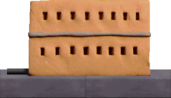
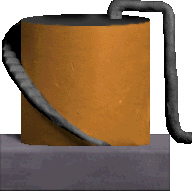

# Enemies

This page aims to document all known enemy types, their numerical values and their functionality. All enemy names have been chosen based on their sprite filenames in Platypus II.

Enemy type numbers are used in both spawnFormation (action 21) and spawnEnemy (action 22) as arg1. The subsequent arguments discussed under each enemy type on this page only apply to spawnEnemy (action 22).

(HELP WANTED - see if all of these are correct/there are any unused actions and arguments)

## bullet (1)

Normal enemy bullet. Unused on its own during normal gameplay.

### args:
(HELP WANTED - needs testing)

## flame (2)

Flame that can be fired by an enemy or flamejet. Deals damage to the player and disappears after a while. Unused on its own during normal gameplay.

### args:
(HELP WANTED - needs testing)

## missile (3)

Missile that homes in on the player while leaving a smoke trail. Explodes after a while if not destroyed by the player. Unused on its own during normal gameplay.

### args:
(HELP WANTED - needs testing)

## laser (4)

Laser that is fired by some enemies. Unused on its own during normal gameplay.

### args:
(HELP WANTED - needs testing)

## orb (5)

Large projectile that is typically fired upwards from red turrets before falling down. Unused on its own during normal gameplay.

### args:
(HELP WANTED - needs testing)

## glob (6)

Indestructible projectile that is fired by some enemies in level 5 (e.g. podship). Unused on its own during normal gameplay.

### args:
(HELP WANTED - needs testing)

## bomb (7)

Explosive bomb that is dropped by bomber and squidcangreen. Explodes into bombfrags when shot by the player. Unused on its own during normal gameplay.

### args:
(HELP WANTED - needs testing)

## bombfrag (8)

Damaging fragments emitted when a bomb or mine explodes. Unused on its own during normal gameplay.

### args:
(HELP WANTED - needs testing)

## mine (9)

Bomb that is tied to a balloon. The balloon can be safely shot down while releasing some fruit. Spawns at a random y-position with random velocity (HELP WANTED - needs testing).

### args:
None (HELP WANTED - needs testing)

## rock (10)

Red-hot rock that falls from the top of the screen during volcanic eruptions. Size/sprite is randomised (HELP WANTED - needs testing). Unused on its own during normal gameplay.

### args:
(HELP WANTED - needs testing)

## unknownEnemy11 (11)

Unused during normal gameplay.

### args:
(HELP WANTED - needs testing)

## unknownEnemy12 (12)

Unused during normal gameplay.

### args:
(HELP WANTED - needs testing)

## unknownEnemy13 (13)

Unused during normal gameplay.

### args:
(HELP WANTED - needs testing)

## flamejet (14)

Spawns a jet of flames upwards.

### args:
None (HELP WANTED - needs testing)

## buoy (15)

Buoy equipped with a cannon that fires two lasers upwards.

### args:
None (HELP WANTED - needs testing)

## dish (16)

Destructible satellite dish that appears near the bottom of the screen. Spawns on top of an instance of tile number 99 on layer 1.

### args:
None (HELP WANTED - needs testing)

## building (17)

Destructible building that spawns at the bottom of the screen. Unused during normal gameplay (HELP WANTED - needs testing).

### args:
(HELP WANTED - needs testing)

## tank (18)

Destructible tank that spawns at the bottom of the screen. Unused during normal gameplay (HELP WANTED - needs testing).

### args:
(HELP WANTED - needs testing)

## wallgun (19)

Destructible wall-mounted gun that aims and fires bullets at the player. Spawned on layer 1 and positioned based on the newest tile.

### args:
- **xOffset (arg2):** spawn x-position offset. Negative values shift x-position to the left, positive values shift x-position to the right (HELP WANTED - needs testing)
- **yOffset (arg3):** spawn y-position offset. Negative values shift y-position upwards, positive values shift y-position downwards (HELP WANTED - needs testing)

## icbm (20)

Large missile that flies downwards from the left of the screen at an angle.

### args:
- **yPos (arg2):** y-position to spawn at

## domeship (21)

Small spherical/dome-shaped enemy that flies along a path (HELP WANTED - needs testing on its own). Normally encountered in formations.

### args:
(HELP WANTED - needs testing)

## domeship2 (22)

Sprite-swapped variant of domeship with otherwise identical behaviour (HELP WANTED - needs testing on its own). Encountered in level 5.

### args:
(HELP WANTED - needs testing)

## saucer (23)

Grey flying saucer enemy that flies leftwards from the right of the screen, occasionally shooting bullets at the player. Normally encountered in formations.

### args:
(HELP WANTED - needs testing)

## saucer2 (24)

Yellow flying saucer enemy that flies leftwards from the right of the screen, occasionally shooting bullets at the player. Normally encountered in formations.

### args:
(HELP WANTED - needs testing)

## saucer_red (25)

Reddish-brown flying saucer enemy that flies leftwards from the right of the screen (HELP WANTED - needs testing on its own). Normally encountered in formations that grant weapon stars upon complete destruction.

### args:
(HELP WANTED - needs testing)

## zipper (26)

Small orange gunship-like enemy that flies rightwards from the left of the screen until it reaches the right, then slowly moves off-screen to the left (HELP WANTED - needs testing on its own). Normally encountered in formations.

### args:
(HELP WANTED - needs testing)

## fish (27)

Grey fish-shaped enemy that flies leftwards from the right of the screen and occasionally fires lasers (HELP WANTED - needs testing on its own). Normally encountered in formations.

### args:
(HELP WANTED - needs testing)

## fish_red (28)

Reddish-brown fish-shaped enemy that flies leftwards from the right of the screen and occasionally fires lasers (HELP WANTED - needs testing on its own). Normally encountered in formations that grant weapon stars upon complete destruction.

### args:
(HELP WANTED - needs testing)

## fish_green (29)

Green fish-shaped enemy with unknown single behaviour and occasionally fires lasers (HELP WANTED - needs testing on its own). Normally encountered in formations.

### args:
(HELP WANTED - needs testing)

## horseshoe (30)

Blue horseshoe-shaped enemy that flies in from the right before turning and flying leftwards, then turning once more to fly rightwards off-screen (HELP WANTED - needs testing on its own). Normally encountered in formations.

### args:
(HELP WANTED - needs testing)

## jumper (31)

Yellow horseshoe-shaped enemy that flies upwards from the bottom before turning and flying downwards off-screen. Has slight horizontal speed during its flight path. Normally encountered in formations (HELP WANTED - needs testing on its own). Single and formation spawns do not work in level 1 (HELP WANTED - see if other levels are affected).

### args:
(HELP WANTED - needs testing)

## ray (32)

Might be identical to the ray from the original Platypus and/or v2ray (HELP WANTED - needs testing). Unused during normal gameplay.

### args:
(HELP WANTED - needs testing)

## v2ray (33)

Teal-coloured variant of the classic ray enemy. Flies leftwards before spinning and flying upwards or downwards.

### args:
- **yPos (arg2):** y-position to spawn at
- **arg3 (arg3):** (HELP WANTED - needs testing)
- **ySpeed (arg4):** y-speed when spinning. Negative values for upwards movement, positive values for downwards movement (HELP WANTED - needs testing/confirmation, test with values other than 1 and -1)

## goldfish (34)

Purple (not gold) enemy that flies in leftwards from the right of the screen and shoots several bullets in a spread formation before flying rightwards off-screen (HELP WANTED - needs testing on its own). Normally encountered in formations.

### args:
(HELP WANTED - needs testing)

## turretred (35)

Red flying turret with squid fins that shoots orbs. Flies directly downwards from the top of the screen until it reaches a specified y-position, then flies to the right before finally moving leftwards off-screen.

### args:
- **xPos (arg2):** x-position to spawn at (HELP WANTED - needs testing)
- **yTarget (arg3):** final y-position after downwards movement (HELP WANTED - needs testing)

## turretpurple (36)

Has identical behaviour to turretred, but is purple and shoots missiles instead.

### args:
- **xPos (arg2):** x-position to spawn at (HELP WANTED - needs testing)
- **yTarget (arg3):** final y-position after downwards movement (HELP WANTED - needs testing)

## flipplane (37)

Purple enemy that flies in from the left before reaching the right of the screen and turning to reveal its true wingspan and two mounted turrets. Shoots bullets at the player as it flies back off-screen to the left.

### args:
- **yPos (arg2):** y-position to spawn at

## flipplane_orange (38)

Slower orange variant of flipplane.

### args:
- **yPos (arg2):** y-position to spawn at

## bomber (39)

Red flipplane that flies from the left to the right of the screen while dropping bombs.

### args:
- **yPos (arg2):** y-position to spawn at

## squidyellow (40)

Small yellow squid enemy that hovers around its position on the right of the screen while shooting lasers directly leftwards before moving leftwards off-screen.

### args:
- **yPos (arg2):** y-position to spawn at

## squidgreen (41)

Large green squid variant with similar movement patterns but shoots several bullets in a spread formation.

### args:
- **yPos (arg2):** y-position to spawn at

## squidcan (42)

Brown trashcan-shaped squid variant with similar movement patterns but shoots lightning.

### args:
- **yPos (arg2):** y-position to spawn at

## squidcangreen (43)

Teal trashcan-shaped squid variant with similar movement patterns but drops bombs.

### args:
- **yPos (arg2):** y-position to spawn at

## yellowie (44)

Yellow passive enemy that flies in from the left before stopping at the far right, then flying leftwards off-screen.

### args:
- **yPos (arg2):** y-position to spawn at

## greenie (45)

Slow green passive enemy that flies from left to right.

### args:
- **yPos (arg2):** y-position to spawn at

## reddie (46)

Large red passive enemy that flies from left to right.

### args:
- **yPos (arg2):** y-position to spawn at

## gunship (47)

Classic red gunship enemy that flies in from the left and hovers around the horizontal center of the screen while shooting bullets aimed at the player, before flying rightwards off-screen.

### args:
- **yPos (arg2):** y-position to spawn at

## lasership (48)

Purple gunship variant that flies in from the right and hovers around in place while shooting lasers leftwards, before flying leftwards off-screen.

### args:
- **yPos (arg2):** y-position to spawn at

## flameship (49)

Yellow gunship variant that with the same movement pattern as the original red gunship, but shoots flames aimed at the player instead.

### args:
- **yPos (arg2):** y-position to spawn at

## homingship (50)

Large green enemy that flies in from the right before stopping at the far left, then flying back rightwards off-screen. Shoots missiles in pairs.

### args:
- **yPos (arg2):** y-position to spawn at

## car (51)

Various cars that spawn at the bottom of the screen and move in from the right. The car type can be specified and multiple cars can be linked to form a train.

### args:
- **type (arg2):** (HELP WANTED - needs testing for unknown values and possible unused car types. Also all car types need testing on their own)
  - **0:** unknown
  - **1:** red front car equipped with a missile launcher and a gun
  - **2:** red front car equipped with a red turret that shoots orbs upwards in a spread formation and a gun
  - **3:** empty car with only a chassis
  - **4:** gold passive car that releases fruit when destroyed
  - **5:** unknown
  - **6:** silver car equipped with two guns
  - **7:** silver car equipped with a missile launcher
  - **8:** silver car equipped with a red turret that shoots orbs upwards in a spread formation
- **link (arg3):** (HELP WANTED - needs testing)
  - **0:** setting disabled
  - **1:** link all previously spawned cars together to form a train

## gunboat (52)

Boat enemy that spawns at the bottom of the screen and travels across horizontally while shooting orbs upwards in a spread formation.

### args:
- **direction (arg2):**
  - **0:** moves from left to right
  - **1:** moves from right to left

## missileboat (53)

Smaller boat enemy that spawns at the bottom of the screen and travels across horizontally while shooting missiles.

### args:
(HELP WANTED - test arg2 to see if its direction can be changed like gunboat and flameboat)

## flameboat (54)

Boat enemy that spawns at the bottom of the screen and travels across horizontally while shooting flames aimed at the player.

### args:
- **direction (arg2):**
  - **0:** moves from left to right
  - **1:** moves from right to left

## boss1 (55)

Large flying orange aircraft that hovers around the right of the screen while firing two pairs of missiles at a time. Formations of fish_green and fish_red are also spawned as support. Encountered at the end of level 4 during normal gameplay.

### args:
None (HELP WANTED - needs testing)

## boss2 (56)

Large green segmented aircraft that looks and moves like a worm. Each body segment is equipped with a gun, while the head fires pairs of missiles. Flies in from right to left, revealing each segment one by one. Destroying a segment also destroys all previous segments. Once the head is disconnected from its adjacent segment or the left edge of the head touches the left edge of the screen, all undestroyed body segments are despawned and the head hovers around freely while beginning its attack pattern. Formations of saucer2 and saucer_red are also spawned as support. Encountered at the end of level 2 during normal gameplay.

### args:
None (HELP WANTED - needs testing)

## unknownEnemy57 (57)

Unused during normal gameplay.

### args:
(HELP WANTED - needs testing)

## boss2_intro (58)

Non-destructible variant of boss2 that flies from left to right. Used to introduce the boss before the actual fight begins.

### args:
None (HELP WANTED - needs testing)

## unknownEnemy59 (59)

Unused during normal gameplay.

### args:
(HELP WANTED - needs testing)

## boss3 (60)

Tall yellow turret that rises from the bottom of the screen at a random x-position before sinking and rising again elsewhere. Fires lasers, launches missiles and shoots orbs upwards in a spread formation. Formations of fish_red are also spawned as support. Encountered at the end of level 1 during normal gameplay.

### args:
None (HELP WANTED - needs testing)

## unknownEnemy61CRASH (61)

Crashes the game. Unused during normal gameplay.

### args:
None

## boss4 (62)

Large boat attached to a balloon that hovers around the screen freely. Equipped with a missile launcher. Does not appear to automatically spawn any enemies as support. Encountered near the end of level 4 (right before boss1) during normal gameplay.

### args:
None (HELP WANTED - needs testing)

## boss5 (63)

Large segmented orange serpent that flies around the screen along seemingly random paths. The head shoots flames while the tail shoots lasers in a spread formation. Head is initially invulnerable and the body segments must be damaged first. Once all body segments have been fully damaged, the head can be damaged. Formations of fish_green and fish_red are also spawned as support. Encountered at the end of level 3 during normal gameplay.

### args:
None (HELP WANTED - needs testing)

## boss5_unknown (64)

Unused variant of boss5 (HELP WANTED - needs more description).

### args:
None (HELP WANTED - needs testing)

## boss5_intro (65)

Non-destructible variant of boss5 that flies straight up from the bottom of the screen while leaving behind some splashes (HELP WANTED - needs confirmation on splash spawns). Used to introduce the boss before the actual fight begins.

### args:
None (HELP WANTED - needs testing)

## boss6 (66)

Large green brain equipped with a gun along with four segmented arms that end with guns. The arms rotate around the brain in a clockwise direction. Each arm (gun) must be destroyed first, then the eye on the brain will open and can be damaged. Each time after the first three arms are destroyed, the boss flies off to the right and several enemies/formations are spawned in a fixed order at fixed positions before the boss returns. Encountered at the end of level 5 during normal gameplay. Full attack pattern and enemy spawns are listed below:

- The boss initially spawns with four arms and its eye closed. The guns on each arm shoot bullets while the gun under the brain shoots globs. Formations of fish_red are spawned as support. Once one arm is destroyed, the boss flies off-screen to the right
- The following enemies/formations are spawned in order:
  - squid formation 0
  - virus formation 0
  - blob
  - podship
  - spinner formation 0
  - blob
  - spinner formation 0
  - squid formation 0
  - squid formation 0
- The boss returns with three arms but otherwise the exact same behaviour and support spawns as before
- The following enemies/formations are spawned in order:
  - virus formation 1
  - worm formation 0
  - eyeball
  - podship
  - worm formation 0
  - eyeball
  - virus formation 0
  - virus formation 1
  - virus formation 0
- The boss returns with two arms and the same behaviour and supports as before, except the firing rate of all guns has been increased
- The following enemies/formations are spawned in order:
  - virus formation 1
  - squid formation 0
  - eyeball
  - 2x podships
  - worm formation 0
  - blob
  - virus formation 0
  - spinner formation 0
  - virus formation 1
- The boss returns with one arm and the firing rate of the last arm gun has been increased further. The gun under the brain now shoots lightning in short bursts instead. Support spawns remain the same.
- Once the last arm is destroyed, the brain begins flying freely while launching missiles and spawning viruses. Virus spawn rate increases as the brain takes more damage. The eye will occasionally open and fire lasers while leaving it vulnerable to attacks. Also spawns formations of fish_red as support

### args:
None (HELP WANTED - needs testing)

## unknownEnemy67 (67)

Unused during normal gameplay.

### args:
(HELP WANTED - needs testing)

## unknownEnemy68CRASH (68)

Crashes the game. Unused during normal gameplay.

### args:
None

## unknownEnemy69CRASH (69)

Crashes the game. Unused during normal gameplay.

### args:
None

## worm (70)

Small brightly coloured worm that flies from right to left (HELP WANTED - needs testing on its own). Normally encountered in formations.

### args:
(HELP WANTED - needs testing)

## eyeball (71)

Large blinking eye that flies in from the left and hovers around the horizontal center of the screen before flying rightwards off-screen. Fires a ring of eight bullets outwards from its center.

### args:
- **yPos (arg2):** y-position to spawn at

## blob (72)

Pink jellyfish that flies from left to right.

### args:
- **yPos (arg2):** y-position to spawn at

## rollship (73)

Small blue fish-like enemy that flies leftwards from the right before spinning and flying upwards or downwards (HELP WANTED - needs testing on its own). Normally encountered in formations.

### args:
(HELP WANTED - needs testing)

## chicken (74)

Purple bird-like creature that flies from left to right (HELP WANTED - needs testing on its own). Normally encountered in formations.

### args:
(HELP WANTED - needs testing)

## bug (75)

Yellow pterodactyl-like creature that flies in from the top and homes in on the player before moving leftwards off-screen (HELP WANTED - needs testing on its own). Normally encountered in formations.

### args:
(HELP WANTED - needs testing)

## tonsil (76)

Fleshy hanging object that damages the player upon impact. Can be destroyed. Spawns at a random y-position.

### args:
None (HELP WANTED - needs testing)

## virus (77)

Small yellow virus that homes in on the player before flying off-screen (HELP WANTED - needs testing on its own). Normally encountered in formations or spawned from ulcers.

### args:
(HELP WANTED - needs testing)

## spinner (78)

Small spinning eyeball that flies from right to left (HELP WANTED - needs testing on its own). Normally encountered in formations.

### args:
(HELP WANTED - needs testing)

## fang (79)

Sharp tooth that flies in the direction it's facing upon encountering the player. Can spawn on either the top or bottom of the screen.

### args:
- **direction (arg2):**
  - **0:** spawn at the top of the screen and fly downwards
  - **1:** spawn at the bottom of the screen and fly upwards

## squid (80)

Small pink jellyfish that flies from right to left (HELP WANTED - needs testing on its own). Normally encountered in formations.

### args:
(HELP WANTED - needs testing)

## podship (81)

Blue gunship-like enemy that shoots globs at the player. Flies in from the left and hovers around the horizontal center of the screen before flying rightwards off-screen.

### args:
- **yPos (arg2):** y-position to spawn at

## miniserpent (82)

Shorter yellow serpent that flies upwards from the bottom of the screen at a random position, turns to the left or right, then falls back down to the bottom of the screen before repeating. Its tail shoots lasers in a spread formation. Only its body segments can be damaged and it explodes after all body segments have been fully damaged.

### args:
None (HELP WANTED - needs testing)