# Enemies

This page aims to document all known enemy types, their numerical values and their functionality. All enemy names have been chosen based on their sprite filenames in Platypus II.

Enemy type numbers are used in both spawnFormation (action 21) and spawnEnemy (action 22) as arg1. The subsequent arguments discussed under each enemy type on this page only apply to spawnEnemy (action 22).

(HELP WANTED - see if all of these are correct/there are any unused actions and arguments)

## bullet (1)

Red flip plane that flies from the left to the right of the screen while dropping bombs.

### args:
- **yPos (arg2):** y-position to spawn at

## flame (2)

Red flip plane that flies from the left to the right of the screen while dropping bombs.

### args:
- **yPos (arg2):** y-position to spawn at

## missile (3)
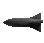

Red flip plane that flies from the left to the right of the screen while dropping bombs.

### args:
- **yPos (arg2):** y-position to spawn at

## laser (4)

Red flip plane that flies from the left to the right of the screen while dropping bombs.

### args:
- **yPos (arg2):** y-position to spawn at

## orb (5)

Red flip plane that flies from the left to the right of the screen while dropping bombs.

### args:
- **yPos (arg2):** y-position to spawn at

## glob (6)
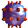

Red flip plane that flies from the left to the right of the screen while dropping bombs.

### args:
- **yPos (arg2):** y-position to spawn at

## bomb (7)
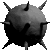

Red flip plane that flies from the left to the right of the screen while dropping bombs.

### args:
- **yPos (arg2):** y-position to spawn at

## bombfrag (8)

Red flip plane that flies from the left to the right of the screen while dropping bombs.

### args:
- **yPos (arg2):** y-position to spawn at

## mine (9)
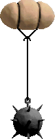

Red flip plane that flies from the left to the right of the screen while dropping bombs.

### args:
- **yPos (arg2):** y-position to spawn at

## rock (10)

Red flip plane that flies from the left to the right of the screen while dropping bombs.

### args:
- **yPos (arg2):** y-position to spawn at

## unknownEnemy11 (11)

Red flip plane that flies from the left to the right of the screen while dropping bombs.

### args:
- **yPos (arg2):** y-position to spawn at

## unknownEnemy12 (12)

Red flip plane that flies from the left to the right of the screen while dropping bombs.

### args:
- **yPos (arg2):** y-position to spawn at

## unknownEnemy13 (13)

Red flip plane that flies from the left to the right of the screen while dropping bombs.

### args:
- **yPos (arg2):** y-position to spawn at

## flamejet (14)

Red flip plane that flies from the left to the right of the screen while dropping bombs.

### args:
- **yPos (arg2):** y-position to spawn at

## buoy (15)
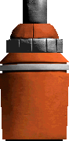

Red flip plane that flies from the left to the right of the screen while dropping bombs.

### args:
- **yPos (arg2):** y-position to spawn at

## dish (16)
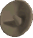

Red flip plane that flies from the left to the right of the screen while dropping bombs.

### args:
- **yPos (arg2):** y-position to spawn at

## building (17)
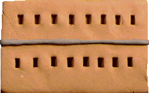

Red flip plane that flies from the left to the right of the screen while dropping bombs.

### args:
- **yPos (arg2):** y-position to spawn at

## tank (18)
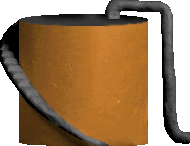

Red flip plane that flies from the left to the right of the screen while dropping bombs.

### args:
- **yPos (arg2):** y-position to spawn at

## wallgun (19)
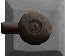

Red flip plane that flies from the left to the right of the screen while dropping bombs.

### args:
- **yPos (arg2):** y-position to spawn at

## icbm (20)
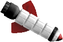

Red flip plane that flies from the left to the right of the screen while dropping bombs.

### args:
- **yPos (arg2):** y-position to spawn at

## domeship (21)

Red flip plane that flies from the left to the right of the screen while dropping bombs.

### args:
- **yPos (arg2):** y-position to spawn at

## domeship2 (22)

Red flip plane that flies from the left to the right of the screen while dropping bombs.

### args:
- **yPos (arg2):** y-position to spawn at

## saucer (23)

Red flip plane that flies from the left to the right of the screen while dropping bombs.

### args:
- **yPos (arg2):** y-position to spawn at

## saucer2 (24)

Red flip plane that flies from the left to the right of the screen while dropping bombs.

### args:
- **yPos (arg2):** y-position to spawn at

## saucer_red (25)

Red flip plane that flies from the left to the right of the screen while dropping bombs.

### args:
- **yPos (arg2):** y-position to spawn at

## zipper (26)
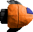

Red flip plane that flies from the left to the right of the screen while dropping bombs.

### args:
- **yPos (arg2):** y-position to spawn at

## fish (27)
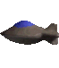

Red flip plane that flies from the left to the right of the screen while dropping bombs.

### args:
- **yPos (arg2):** y-position to spawn at

## fish_red (28)
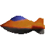

Red flip plane that flies from the left to the right of the screen while dropping bombs.

### args:
- **yPos (arg2):** y-position to spawn at

## fish_green (29)

Red flip plane that flies from the left to the right of the screen while dropping bombs.

### args:
- **yPos (arg2):** y-position to spawn at

## horseshoe (30)

Red flip plane that flies from the left to the right of the screen while dropping bombs.

### args:
- **yPos (arg2):** y-position to spawn at

## jumper (31)

Red flip plane that flies from the left to the right of the screen while dropping bombs.

### args:
- **yPos (arg2):** y-position to spawn at

## ray (32)

Red flip plane that flies from the left to the right of the screen while dropping bombs.

### args:
- **yPos (arg2):** y-position to spawn at

## v2ray (33)

Red flip plane that flies from the left to the right of the screen while dropping bombs.

### args:
- **yPos (arg2):** y-position to spawn at

## goldfish (34)
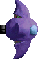

Red flip plane that flies from the left to the right of the screen while dropping bombs.

### args:
- **yPos (arg2):** y-position to spawn at

## turretred (35)
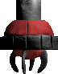

Red flip plane that flies from the left to the right of the screen while dropping bombs.

### args:
- **yPos (arg2):** y-position to spawn at

## turretpurple (36)
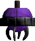

Red flip plane that flies from the left to the right of the screen while dropping bombs.

### args:
- **yPos (arg2):** y-position to spawn at

## flipplane (37)
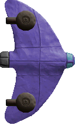

Red flip plane that flies from the left to the right of the screen while dropping bombs.

### args:
- **yPos (arg2):** y-position to spawn at

## flipplane_orange (38)

Red flip plane that flies from the left to the right of the screen while dropping bombs.

### args:
- **yPos (arg2):** y-position to spawn at

## bomber (39)
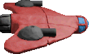

Red flip plane that flies from the left to the right of the screen while dropping bombs.

### args:
- **yPos (arg2):** y-position to spawn at

## squidyellow (40)

Red flip plane that flies from the left to the right of the screen while dropping bombs.

### args:
- **yPos (arg2):** y-position to spawn at

## squidgreen (41)

Red flip plane that flies from the left to the right of the screen while dropping bombs.

### args:
- **yPos (arg2):** y-position to spawn at

## squidcan (42)
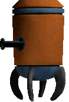

Red flip plane that flies from the left to the right of the screen while dropping bombs.

### args:
- **yPos (arg2):** y-position to spawn at

## squidcangreen (43)
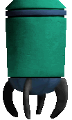

Red flip plane that flies from the left to the right of the screen while dropping bombs.

### args:
- **yPos (arg2):** y-position to spawn at

## yellowie (44)
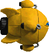

Red flip plane that flies from the left to the right of the screen while dropping bombs.

### args:
- **yPos (arg2):** y-position to spawn at

## greenie (45)
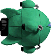

Red flip plane that flies from the left to the right of the screen while dropping bombs.

### args:
- **yPos (arg2):** y-position to spawn at

## reddie (46)
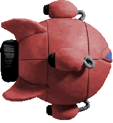

Red flip plane that flies from the left to the right of the screen while dropping bombs.

### args:
- **yPos (arg2):** y-position to spawn at

## gunship (47)
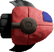

Red flip plane that flies from the left to the right of the screen while dropping bombs.

### args:
- **yPos (arg2):** y-position to spawn at

## lasership (48)
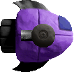

Red flip plane that flies from the left to the right of the screen while dropping bombs.

### args:
- **yPos (arg2):** y-position to spawn at

## flameship (49)
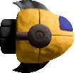

Red flip plane that flies from the left to the right of the screen while dropping bombs.

### args:
- **yPos (arg2):** y-position to spawn at

## homingship (50)
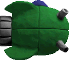

Red flip plane that flies from the left to the right of the screen while dropping bombs.

### args:
- **yPos (arg2):** y-position to spawn at

## car (51)
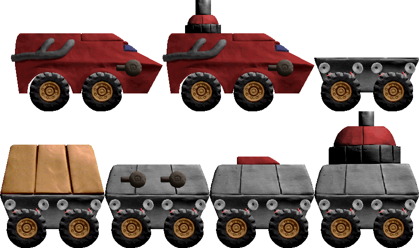

Red flip plane that flies from the left to the right of the screen while dropping bombs.

### args:
- **yPos (arg2):** y-position to spawn at

## gunboat (52)
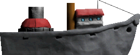

Red flip plane that flies from the left to the right of the screen while dropping bombs.

### args:
- **yPos (arg2):** y-position to spawn at

## missileboat (53)
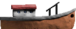

Red flip plane that flies from the left to the right of the screen while dropping bombs.

### args:
- **yPos (arg2):** y-position to spawn at

## flameboat (54)
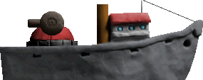

Red flip plane that flies from the left to the right of the screen while dropping bombs.

### args:
- **yPos (arg2):** y-position to spawn at

## boss1 (55)
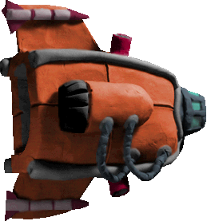

Red flip plane that flies from the left to the right of the screen while dropping bombs.

### args:
- **yPos (arg2):** y-position to spawn at

## boss2 (56)
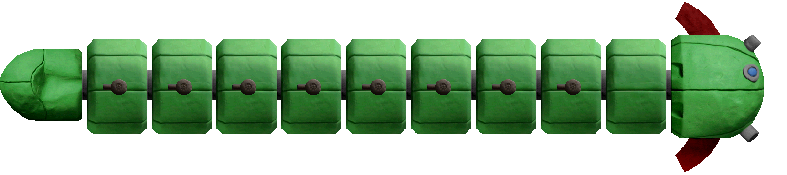

Red flip plane that flies from the left to the right of the screen while dropping bombs.

### args:
- **yPos (arg2):** y-position to spawn at

## unknownEnemy57 (57)

Red flip plane that flies from the left to the right of the screen while dropping bombs.

### args:
- **yPos (arg2):** y-position to spawn at

## boss2_intro (58)

Red flip plane that flies from the left to the right of the screen while dropping bombs.

### args:
- **yPos (arg2):** y-position to spawn at

## unknownEnemy59 (59)

Red flip plane that flies from the left to the right of the screen while dropping bombs.

### args:
- **yPos (arg2):** y-position to spawn at

## boss3 (60)
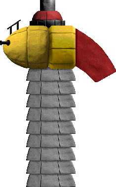

Red flip plane that flies from the left to the right of the screen while dropping bombs.

### args:
- **yPos (arg2):** y-position to spawn at

## unknownEnemy61CRASH (61)

Red flip plane that flies from the left to the right of the screen while dropping bombs.

### args:
- **yPos (arg2):** y-position to spawn at

## boss4 (62)
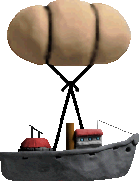

Red flip plane that flies from the left to the right of the screen while dropping bombs.

### args:
- **yPos (arg2):** y-position to spawn at

## boss5 (63)
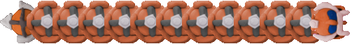

Red flip plane that flies from the left to the right of the screen while dropping bombs.

### args:
- **yPos (arg2):** y-position to spawn at

## boss5_unknown (64)

Red flip plane that flies from the left to the right of the screen while dropping bombs.

### args:
- **yPos (arg2):** y-position to spawn at

## boss5_intro (65)

Red flip plane that flies from the left to the right of the screen while dropping bombs.

### args:
- **yPos (arg2):** y-position to spawn at

## boss6 (66)
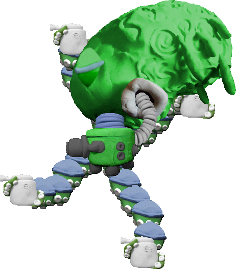

Red flip plane that flies from the left to the right of the screen while dropping bombs.

### args:
- **yPos (arg2):** y-position to spawn at

## unknownEnemy67 (67)

Red flip plane that flies from the left to the right of the screen while dropping bombs.

### args:
- **yPos (arg2):** y-position to spawn at

## unknownEnemy68CRASH (68)

Red flip plane that flies from the left to the right of the screen while dropping bombs.

### args:
- **yPos (arg2):** y-position to spawn at

## unknownEnemy69CRASH (69)

Red flip plane that flies from the left to the right of the screen while dropping bombs.

### args:
- **yPos (arg2):** y-position to spawn at

## worm (70)
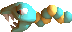

Red flip plane that flies from the left to the right of the screen while dropping bombs.

### args:
- **yPos (arg2):** y-position to spawn at

## eyeball (71)
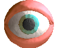

Red flip plane that flies from the left to the right of the screen while dropping bombs.

### args:
- **yPos (arg2):** y-position to spawn at

## blob (72)
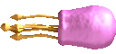

Red flip plane that flies from the left to the right of the screen while dropping bombs.

### args:
- **yPos (arg2):** y-position to spawn at

## rollship (73)
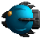

Red flip plane that flies from the left to the right of the screen while dropping bombs.

### args:
- **yPos (arg2):** y-position to spawn at

## chicken (74)
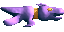

Red flip plane that flies from the left to the right of the screen while dropping bombs.

### args:
- **yPos (arg2):** y-position to spawn at

## bug (75)
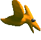

Red flip plane that flies from the left to the right of the screen while dropping bombs.

### args:
- **yPos (arg2):** y-position to spawn at

## tonsil (76)
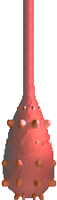

Red flip plane that flies from the left to the right of the screen while dropping bombs.

### args:
- **yPos (arg2):** y-position to spawn at

## virus (77)
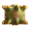

Red flip plane that flies from the left to the right of the screen while dropping bombs.

### args:
- **yPos (arg2):** y-position to spawn at

## spinner (78)
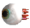

Red flip plane that flies from the left to the right of the screen while dropping bombs.

### args:
- **yPos (arg2):** y-position to spawn at

## fang (79)
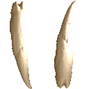

Sharp tooth that flies in the direction it's facing upon encountering the player. Can spawn on either the top or bottom of the screen.

### args:
- **direction (arg2):**
  - 0: spawn at the top of the screen and fly downwards
  - 1: spawn at the bottom of the screen and fly upwards

## squid (80)
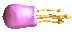

Red flip plane that flies from the left to the right of the screen while dropping bombs.

### args:
- **yPos (arg2):** y-position to spawn at

## podship (81)
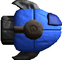

Red flip plane that flies from the left to the right of the screen while dropping bombs.

### args:
- **yPos (arg2):** y-position to spawn at

## miniserpent (82)
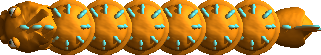

Red flip plane that flies from the left to the right of the screen while dropping bombs.

### args:
- **yPos (arg2):** y-position to spawn at