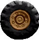
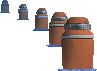
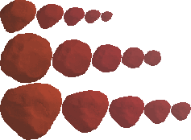
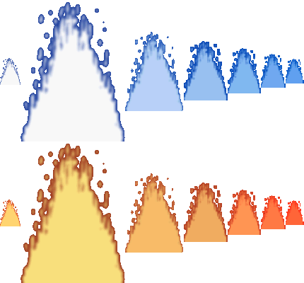
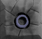
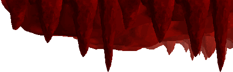
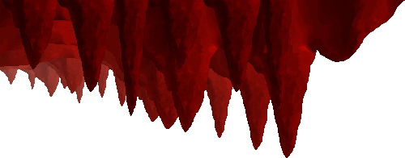
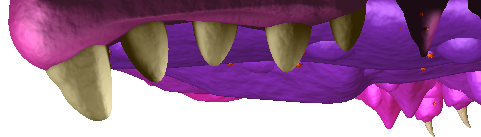
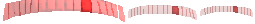

# Scenery

This page aims to document all known scenery types, their numerical values and their functionality. All scenery names were found in the Platypus II executable using a hex editor.

Scenery type numbers are used in scenery (action 23) as arg1.

## cloud (1)

Cloud that moves from right to left.

### args:
| arg# | Name  | Description                                                                                                                                                                    |
|------|-------|--------------------------------------------------------------------------------------------------------------------------------------------------------------------------------|
| `2`  | `img` | Sprite number. <ul> <li>A value of 0 will cause the scenery to use a random sprite</li> </ul>                                                                                  |
| `3`  | `x`   | Spawn x-position. <ul> <li>A value of 0 will cause the scenery to spawn just off-screen on the right</li> </ul>                                                                |
| `4`  | `y`   | Spawn y-position. <ul> <li>A value of 0 will cause the scenery to spawn at a random y-position (range TBD, TODO)</li> </ul>                                                    |
| `5`  | `d`   | Speed. <ul> <li>A value of 0 will cause the scenery to move with a random speed (range TBD, TODO)</li> <li>Negative values will cause the scenery to move backwards</li> </ul> |

## wheel (2)

Car wheel that gets thrown upwards slightly with a random speed before falling downwards off-screen. Normally spawned upon destroying a car (enemy type 51).

### args:
| arg# | Name | Description       |
|------|------|-------------------|
| `2`  | `x`  | Spawn x-position. |
| `3`  | `y`  | Spawn y-position. |
| `4`  | `dx` | Set x-speed.      |

## arch (3)

Red arch-shaped structure constructed out of sections on different layers. The top section on layer 1 damages the player upon contact, but the player can safely fly below or above it.

### args:
| arg# | Name        | Description                                                                                                              |
|------|-------------|--------------------------------------------------------------------------------------------------------------------------|
| `2`  | `sololayer` | Layer to isolate. <ul> <li>A value of 0 will display all layers as normal</li> <li>Layer 0 cannot be isolated</li> </ul> |

## pylon (4)

A whole row of power lines on the classic grey poles across different layers. The power lines on layer 1 damage the player upon contact.

### args:
| arg# | Name        | Description                                                                                                              |
|------|-------------|--------------------------------------------------------------------------------------------------------------------------|
| `2`  | `sololayer` | Layer to isolate. <ul> <li>A value of 0 will display all layers as normal</li> <li>Layer 1 cannot be isolated</li> </ul> |

## telegraph (5)

A whole row of power lines on brown poles across different layers. The power lines on layer 1 damage the player upon contact.

### args:
| arg# | Name        | Description                                                                                                              |
|------|-------------|--------------------------------------------------------------------------------------------------------------------------|
| `2`  | `sololayer` | Layer to isolate. <ul> <li>A value of 0 will display all layers as normal</li> <li>Layer 1 cannot be isolated</li> </ul> |

## buoy (6)

A single buoy. The sprite numbers match the layers they spawn on.

### args:
| arg# | Name  | Description    |
|------|-------|----------------|
| `2`  | `img` | Sprite number. |

## buoyline (7)

A whole row of buoys that appear across different background layers.

### args:
None

## windmill (8)

Lone windmill with a pair of spinning propellers. The graphics for the propellers cannot be changed. The sprite numbers match the layers they spawn on.

### args:
| arg# | Name  | Description    |
|------|-------|----------------|
| `2`  | `img` | Sprite number. |

## volcano (9)

TODO

### args:
None (TODO - needs testing)

## rock (10)

Falling rock that is usually seen during volcanic eruptions. Disappears and shows a splash animation once it hits the water. Spawns with a random sprite.

### args:
| arg# | Name        | Description                                                                                          |
|------|-------------|------------------------------------------------------------------------------------------------------|
| `2`  | `layername` | Layer number.                                                                                        |
| `3`  | `x`         | Spawn x-position.                                                                                    |
| `4`  | `y`         | Spawn y-position.                                                                                    |
| `5`  | `dx`        | Set x-speed.                                                                                         |
| `6`  | `dy`        | Set y-speed. <ul> <li>A value of 0 causes the scenery to fallback on its default y-speed.</li> </ul> |

## waterfall (11)

Flowing waterfall. Spawns an instance of tile number 54 below it on the chosen layer. If this tile does not exist, the scenery will spawn out of thin air in the middle of the screen.

### args: 
| arg# | Name        | Description                                                                                                      |
|------|-------------|------------------------------------------------------------------------------------------------------------------|
| `2`  | `layername` | Layer number. <ul> <li>Sprite number 1 is used on layer 3</li> <li>Sprite number 2 is used on layer 1</li> </ul> |

## splash (12)

Splash that appears on the surface of water or lava.

### args:
| arg# | Name        | Description                                                                                                                                                                            |
|------|-------------|----------------------------------------------------------------------------------------------------------------------------------------------------------------------------------------|
| `2`  | `x`         | Spawn x-position.                                                                                                                                                                      |
| `3`  | `type`      | Splash type: <table> <thead> <tr> <th>Value</th> <th>Type</th> </tr> </thead> <tbody> <tr> <td>`0`</td> <td>Small</td> </tr> <tr> <td>`1`</td> <td>Normal</td> </tr> </tbody> </table> |
| `4`  | `layername` | Layer number. <ul> <li>Only works with normal sized splashes</li> </ul>                                                                                                                |

## boat (13)

Boat that moves from right to left in the near background.

### args:
| arg# | Name  | Description                                                                                   |
|------|-------|-----------------------------------------------------------------------------------------------|
| `2`  | `img` | Sprite number. <ul> <li>A value of 0 will cause the scenery to use a random sprite</li> </ul> |

## boatfar (14)

Boat that moves from right to left in the far background.

### args:
| arg# | Name  | Description                                                                                   |
|------|-------|-----------------------------------------------------------------------------------------------|
| `2`  | `img` | Sprite number. <ul> <li>A value of 0 will cause the scenery to use a random sprite</li> </ul> |

## wallgun (15)

Ruined base panel left behind after destroying a wallgun enemy (enemy type 19). Spawns on layer 1.

### args:
| arg# | Name     | Description                       |
|------|----------|-----------------------------------|
| `2`  | `layerx` | Spawn x-position, based on tiles. |
| `3`  | `y`      | Spawn y-position.                 |

## building (16)

Destructible building that spawns at the bottom of the screen and leaves behind a base. The destructible portion damages the player on contact and can be spawned on its own using [enemy type 17](enemies.md#building-17).

### args:
None

## tank (17)

Destructible tank that spawns at the bottom of the screen and leaves behind a base. The destructible portion damages the player on contact and can be spawned on its own using [enemy type 18](enemies.md#tank-18).

### args:
None

## parrot (18)

Green parrot that flies from right to left at a slight upward angle.

### args:
| arg# | Name  | Description                                                                                                    |
|------|-------|----------------------------------------------------------------------------------------------------------------|
| `2`  | `img` | Sprite number. <ul> <li>A value of 0 will cause the scenery to use a random sprite</li> </ul>                  |
| `3`  | `y`   | Spawn y-position. <ul> <li>A value of 0 will cause the scenery to be spawned at a random y-position</li> </ul> |

## bird (19)

Distant blue bird that spawns at a random y-position on the right edge of the screen and flies along a random path.

### args:
None

## birdred (20)

Distant rid bird that spawns at a random y-position on the right edge of the screen and flies along a random path.

### args:
None

## birdyellow (21)

Distant yellow bird that spawns at a random y-position on the right edge of the screen and flies along a random path.

### args:
None

## icbm (22)

Large missile that launches upwards sometime after spawning. Spawns on layer 5.

### args:
| arg# | Name     | Description                         |
|------|----------|-------------------------------------|
| `2`  | `layerx` | Spawn x-position, based on tiles.   |
| `3`  | `layery` | Spawn y-position, based on tiles    |
| `4`  | `time`   | Time? (TODO TEST) before launching. |

## yellowie (23)

Distant yellowie that flies from left to right.

### args:
| arg# | Name   | Description                                                                                                    |
|------|--------|----------------------------------------------------------------------------------------------------------------|
| `2`  | `y`    | Spawn y-position. <ul> <li>A value of 0 will cause the scenery to be spawned at a random y-position</li> </ul> |

## yellowie2 (24)

Distant yellowie variant with a grey-ish hue that flies from left to right.

### args:
| arg# | Name   | Description                                                                                                    |
|------|--------|----------------------------------------------------------------------------------------------------------------|
| `2`  | `y`    | Spawn y-position. <ul> <li>A value of 0 will cause the scenery to be spawned at a random y-position</li> </ul> |

## greenie (25)

Distant greenie that flies from left to right.

### args:
| arg# | Name   | Description                                                                                                    |
|------|--------|----------------------------------------------------------------------------------------------------------------|
| `2`  | `y`    | Spawn y-position. <ul> <li>A value of 0 will cause the scenery to be spawned at a random y-position</li> </ul> |

## reddie (26)

Distant reddie that flies from left to right.

### args:
| arg# | Name   | Description                                                                                                    |
|------|--------|----------------------------------------------------------------------------------------------------------------|
| `2`  | `y`    | Spawn y-position. <ul> <li>A value of 0 will cause the scenery to be spawned at a random y-position</li> </ul> |

## roof (27)

Begin spawning the cave roof tiles seen in level 3. On each layer, spawn a single instance of tile number 1 before randomly spawning tiles from number 2 to 4. Strange things happen when more than one spawner is active simultaneously.

### args:
None

## roofend (28)

Finish spawning the cave roof tiles seen in level 3. On each layer, spawn a single instance of tile number 5 before stopping random tile spawns.

### args:
None

## roofbit (29)

Spawn a single cave roof tile.

### args:
| arg# | Name        | Description   |
|------|-------------|---------------|
| `2`  | `layername` | Layer number. |
| `3`  | `img`       | Tile number.  |

## last (30)

Begin spawning the alien mouth roof tiles seen in level 5.  On each layer, spawn a single instance of tile number 1 before randomly spawning tiles from number 2 to 4. Strange things happen when more than one spawner is active simultaneously.

### args:
None

## lastbit (31)

Spawn a single alien mouth roof tile.

### args:
| arg# | Name        | Description   |
|------|-------------|---------------|
| `2`  | `layername` | Layer number. |
| `3`  | `img`       | Tile number.  |

## greenhead (32)

Cameo appearance of Silthax, the main antagonist of NUX. Briefly pops up from the bottom of the screen at a fixed position before retreating.

### args:
None

## mine (33)

Distant mine that spawns at a random y-position with random speed.

### args:
| arg# | Name  | Description                                                                                   |
|------|-------|-----------------------------------------------------------------------------------------------|
| `2`  | `img` | Sprite number. <ul> <li>A value of 0 will cause the scenery to use a random sprite</li> </ul> |

## nuxship (34)

NUX's ship from the game of the same name. Spawns on layer 4.

### args:
| arg# | Name     | Description                       |
|------|----------|-----------------------------------|
| `2`  | `layerx` | Spawn x-position, based on tiles. |
| `3`  | `layery` | Spawn y-position, based on tiles. |

## krider (35)

A row of red lights that illuminate in a scrolling pattern with a randomised direction. Normally spawned automatically on top of tile number 60. The sprite numbers match the layers they spawn on.

- The preview image above shows all frames at once for clarity

### args:
| arg# | Name     | Description                       |
|------|----------|-----------------------------------|
| `2`  | `img`    | Sprite number.                    |
| `3`  | `layerx` | Spawn x-position, based on tiles. |
| `4`  | `layery` | Spawn y-position, based on tiles. |

## tonsil (36)

Distant tonsil that spawns at a random y-position. The sprite numbers match the layers they spawn on.

### args:
| arg# | Name  | Description                                                                                   |
|------|-------|-----------------------------------------------------------------------------------------------|
| `2`  | `img` | Sprite number. <ul> <li>A value of 0 will cause the scenery to use a random sprite</li> </ul> |

## ulcer (37)

Festering ulcer that explodes when the player gets close to it, releasing three virus enemies. Spawns on layer 6.

### args:
| arg# | Name   | Description                                                                                                    |
|------|--------|----------------------------------------------------------------------------------------------------------------|
| `2`  | `y`    | Spawn y-position. <ul> <li>A value of 0 will cause the scenery to be spawned at a random y-position</li> </ul> |

## eyeball (38)

Distant eyeball that flies from left to right.

### args:
| arg# | Name   | Description                                                                                                    |
|------|--------|----------------------------------------------------------------------------------------------------------------|
| `2`  | `y`    | Spawn y-position. <ul> <li>A value of 0 will cause the scenery to be spawned at a random y-position</li> </ul> |

## podship (39)

Distant podship that flies from left to right.

### args:
| arg# | Name   | Description                                                                                                    |
|------|--------|----------------------------------------------------------------------------------------------------------------|
| `2`  | `y`    | Spawn y-position. <ul> <li>A value of 0 will cause the scenery to be spawned at a random y-position</li> </ul> |