# Scenery

This page aims to document all known scenery types, their numerical values and their functionality. All scenery names have been chosen based on their sprite filenames in Platypus II.

Scenery type numbers are used in spawnScenery (action 23) as arg1.

(HELP WANTED - see if all of these are correct/there are any unused scenery objects and arguments)

## cloud (1)
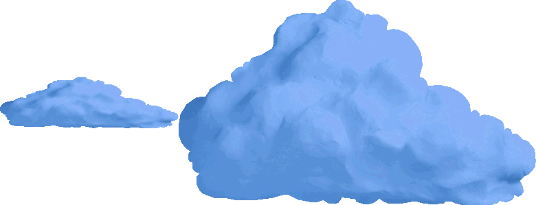

Cloud that moves from right to left. Sprite can be customised. Spawns at a random y-position with a random x-speed.

### args:
- **sprite (arg2):** sprite number to use
- **xPos (arg3):** x-position to spawn at. If greater than 0, spawn directly on the screen at the specified position. Otherwise, spawn off-screen and slowly move from right to left (HELP WANTED - needs confirmation)

## unknownScenery2 (2)

Unused during normal gameplay.

### args:
(HELP WANTED - needs testing)

## arch (3)
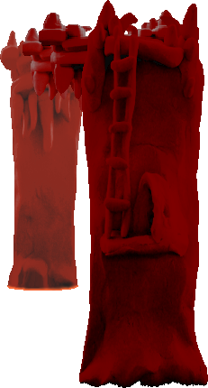

Red arch-shaped structure constructed out of sections on different layers. The top section on layer 1 damages the player upon contact, but the player can safely fly below or above it.

### args:
- **layer (arg2):** layer to isolate. Set to 0 to display all layers, layer 0 cannot be isolated

## pylon (4)
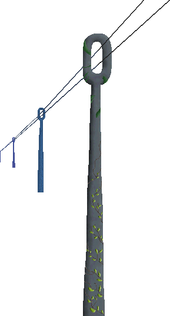

A whole row of power lines on the classic grey poles across different layers. The power lines on layer 1 damage the player upon contact.

### args:
- **layer (arg2):** layer to isolate. Set to 0 to display all layers, layer 1 cannot be isolated

## telegraph (5)
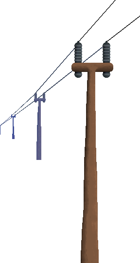

A whole row of power lines on brown poles across different layers. The power lines on layer 1 damage the player upon contact.

### args:
- **layer (arg2):** layer to isolate. Set to 0 to display all layers, layer 1 cannot be isolated

## buoy (6)
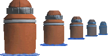

A single buoy. Layer/sprite can be customised.

### args:
- **layer (arg2):** layer/sprite to use

## buoy_row (7)

A whole row of buoys that appear across different background layers.

### args:
None

## windmill (8)
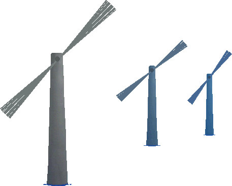

TODO

### args:
- **layer (arg2):** layer to spawn on (HELP WANTED - needs testing, find where the graphics for the spinning blades are located)

## volcano (9)

TODO

### args:
None (HELP WANTED - needs testing)

## rock (10)

Falling rock that is usually seen during volcanic eruptions. Disappears and shows a splash animation once it hits the water.

### args:
- **layer (arg2):** layer to spawn on. There are no rock sprites for layers 1 and 2, but the corresponding splash will display anyway
- **xPos (arg3):** x-position to spawn at

## waterfall (11)
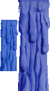

Flowing waterfall. Spawns on top of an instance of tile number 54 on the chosen layer (Note: in-game, sprite number 2 is used for layer 1 spawns, while sprite number 1 is used for layer 3 spawns).

### args:
- **layer (arg2):** layer to spawn on (HELP WANTED - needs testing)

## unknownScenery12 (12)

Unused during normal gameplay.

### args:
(HELP WANTED - needs testing)

## boat (13)
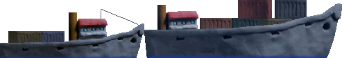

Boat that moves from right to left in the near background. Sprite is chosen at random.

### args:
None (HELP WANTED - test if the sprite can be chosen)

## boatfar (14)
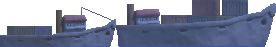

Boat that moves from right to left in the far background. Sprite is chosen at random.

### args:
None (HELP WANTED - test if the sprite can be chosen)

## unknownScenery15 (15)

Unused during normal gameplay.

### args:
(HELP WANTED - needs testing)

## building (16)

Destructible building that spawns at the bottom of the screen and leaves behind a base. The destructible portion damages the player on contact and can be spawned on its own using [enemy type 17](enemies.md#building-17).

### args:
None

## tank (17)

Destructible tank that spawns at the bottom of the screen and leaves behind a base. The destructible portion damages the player on contact and can be spawned on its own using [enemy type 18](enemies.md#tank-18).

### args:
None

## parrot (18)
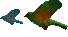

Green parrot that flies from right to left at a slight upward angle. Sprite/layer can be customised. Spawns at a random y-position.

### args:
- **sprite (arg2):** sprite number to use (HELP WANTED - needs testing)

## bird (19)

Distant blue bird that flies along a random path.

### args:
None (HELP WANTED - needs testing)

## birdred (20)

Distant red bird that flies along a random path.

### args:
None (HELP WANTED - needs testing)

## birdyellow (21)

Distant yellow bird that flies along a random path.

### args:
None (HELP WANTED - needs testing)

## icbm (22)
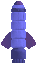

Large missile that launches upwards sometime after spawning. Spawned on layer 5 and positioned based on the newest tile.

### args:
- **xOffset (arg2):** spawn x-position offset. Negative values shift x-position to the left, positive values shift x-position to the right (HELP WANTED - needs testing)
- **yOffset (arg3):** spawn y-position offset. Negative values shift y-position upwards, positive values shift y-position downwards (HELP WANTED - needs testing)
- **launchDelay (arg4):** time to wait before launching after spawning, in game ticks (HELP WANTED - needs testing)

## yellowie (23)
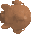

Distant yellowie that flies from left to right. Spawns at a random y-position.

### args:
None (HELP WANTED - needs testing)

## yellowie2 (24)

Distant yellowie variant with a grey-ish hue that flies from left to right. Spawns at a random y-position.

### args:
None (HELP WANTED - needs testing)

## greenie (25)
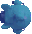

Distant greenie that flies from left to right. Spawns at a random y-position.

### args:
None (HELP WANTED - needs testing)

## reddie (26)
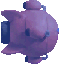

Distant reddie that flies from left to right. Spawns at a random y-position.

### args:
None (HELP WANTED - needs testing)

## roof_start (27)

Begin spawning the cave roof tiles seen in level 3. On each layer, spawn a single instance of tile number 1 before randomly spawning tiles from number 2 to 4 (HELP WANTED - needs testing to see if additional tiles can be added, and what happens if two roof_start actions are called without roof_end).

### args:
None (HELP WANTED - needs testing)

## roof_end (28)

Finish spawning the cave roof tiles seen in level 3. On each layer, spawn a single instance of tile number 5 before stopping random tile spawns. (HELP WANTED - needs testing to see if additional tiles can be added, and what happens if two roof_end actions are called without roof_start).

### args:
None (HELP WANTED - needs testing)

## unknownScenery29 (29)

Unused during normal gameplay.

### args:
(HELP WANTED - needs testing)

## last_start (30)

Begin spawning the alien mouth roof tiles seen in level 5.  On each layer, spawn a single instance of tile number 1 before randomly spawning tiles from number 2 to 4 (HELP WANTED - needs testing to see if additional tiles can be added, and what happens if two last_start actions are called).

### args:
None (HELP WANTED - needs testing)

## unknownScenery31 (31)

Unused during normal gameplay.

### args:
(HELP WANTED - needs testing)

## greenhead (32)
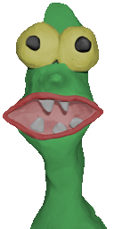

Cameo appearance of Silthax, the main antagonist of NUX. Briefly pops up from the bottom of the screen before retreating.

### args:
None (HELP WANTED - needs testing)

## mine (33)
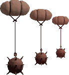

Distant mine that spawns at a random y-position with random velocity.

### args:
- **sprite (arg2):** sprite number to use. 0 to use a random sprite

## nuxship (34)
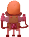

NUX's ship from the game of the same name. Spawned on layer 4 and positioned based on the newest tile.

### args:
- **xOffset (arg2):** spawn x-position offset. Negative values shift x-position to the left, positive values shift x-position to the right (HELP WANTED - needs testing)
- **yOffset (arg3):** spawn y-position offset. Negative values shift y-position upwards, positive values shift y-position downwards (HELP WANTED - needs testing)

## unknownScenery35 (35)

Unused during normal gameplay.

### args:
(HELP WANTED - needs testing)

## tonsil (36)
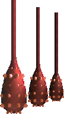

Distant tonsil that spawns on a random layer at a random y-position.

### args:
None (HELP WANTED - needs testing)

## ulcer (37)
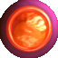

Festering ulcer that explodes after a while, releasing three virus enemies. Spawns on layer 6 at a random y-position.

### args:
None (HELP WANTED - needs testing)

## eyeball (38)
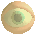

Distant eyeball that flies from left to right. Spawns at a random y-position.

### args:
None (HELP WANTED - needs testing)

## podship (39)
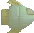

Distant podship that flies from left to right. Spawns at a random y-position.

### args:
None (HELP WANTED - needs testing)